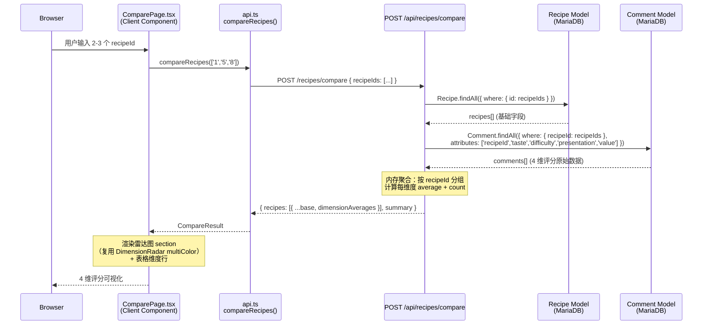

# 01-design.md — ComparePage 集成 4 维评分可视化

> **TaskID:** T-2026-0612-002  
> **Author:** architect  
> **Created:** 2026-06-12  
> **Status:** Draft → Plan Review  
> **Parent Story:** 00-story.md（3 用户故事 + 8 AC）

---

## §0 TL;DR（方案摘要）

在 `POST /api/recipes/compare` 返回的每个 recipe 对象中新增 `dimensionAverages` 字段（批量聚合 Comment 表 4 维字段，单次 `findAll` + 内存计算）。前端 ComparePage 在对比表格上方新增「4 维评分对比」雷达图 section（复用 `DimensionRadar` 组件，`multiColor` 模式），并在对比表格中新增 4 行维度数值行。移动端单列降级，暗色模式沿用现有 `body.dark .cmp-*` 体系。

**In Scope:**
- 后端 compare 路由扩展（批量 Comment 查询 + 内存聚合）
- 前端 ComparePage 新增雷达图 section + 表格维度行
- ComparePage.css 新增样式（radar grid / dark / responsive）
- 前后端测试用例扩展

**Out of Scope:**
- DimensionRadar 组件内部改动（纯复用）
- 新 API 端点（不新增路由）
- 数据库 schema 变更（Comment 表 4 维字段已存在）
- 其他页面的 4 维可视化

---

## §1 总体架构

### 1.1 架构图（Mermaid）



### 1.2 数据流

```
用户输入 recipeIds
  → compareRecipes(ids)
    → POST /api/recipes/compare
      → Recipe.findAll (基础字段)
      → Comment.findAll (4 维字段, 批量)
      → 内存聚合 dimensionAverages
    ← { recipes: [{ ...base, dimensionAverages }], summary }
  ← CompareResult
→ ComparePage 渲染:
    1. 雷达图 section（DimensionRadar × N, multiColor）
    2. 对比表格（新增 4 行维度数值）
```

---

## §2 技术选型

| 选型 | 选择 | 理由 |
|------|------|------|
| 后端聚合方式 | 单次 `Comment.findAll` + 内存 `reduce` | AC-2 强制要求：禁止 N+1；Comment 表已有 `idx_comment_recipeId` 索引，批量查询性能可接受 |
| 雷达图组件 | 复用 `DimensionRadar`（不改内部） | 已支持 `multiColor` 模式 + 暗色自动切换 + 空态兜底；接口通用（`data: Record<string, DimensionValue>`） |
| 前端数据获取 | 现有 `compareRecipes()` 调用不变 | 仅扩展返回类型，不改变调用方式 |
| 维度标签常量 | ComparePage 内自维护 `DIMENSION_LABELS` | 00-story.md §6 建议避免跨模块耦合；4 个常量维护成本极低 |
| CSS 方案 | 沿用 `ComparePage.css` 新增 class | 现有 `.cmp-*` 命名体系 + `body.dark .cmp-*` 暗色模式已成熟 |
| 测试框架 | Vitest (前端) + Jest/Supertest (后端) | 与现有测试体系一致 |

---

## §3 模块划分

### 3.1 后端模块

| 模块 | 文件 | 改动类型 | 说明 |
|------|------|----------|------|
| compare 路由 | `backend/routes/compare.js` | **修改** | 新增 Comment 批量查询 + dimensionAverages 聚合；扩展返回字段 |
| compare 测试 | `backend/tests/compare.test.js` | **修改** | 新增 dimensionAverages 相关测试用例（AC-3） |

### 3.2 前端模块

| 模块 | 文件 | 改动类型 | 说明 |
|------|------|----------|------|
| API 类型 | `frontend/src/api.ts` | **修改** | `CompareRecipe` 接口新增 `dimensionAverages` 字段 |
| ComparePage | `frontend/src/pages/ComparePage.tsx` | **修改** | 新增雷达图 section + 表格维度行 |
| ComparePage 样式 | `frontend/src/pages/ComparePage.css` | **修改** | 新增 `.cmp-radar-*` 系列样式 + dark + responsive |
| ComparePage 测试 | `frontend/src/pages/ComparePage.test.tsx` | **修改** | mock 数据新增 dimensionAverages，验证雷达图渲染 |
| DimensionRadar | `frontend/src/components/DimensionRadar.tsx` | **复用（不改）** | 直接 `<DimensionRadar data={r.dimensionAverages} multiColor size="sm\|md" />` |

---

## §4 数据契约

### 4.1 API 契约

#### POST /api/recipes/compare

**Request（不变）：**
```json
{ "recipeIds": ["1", "5", "8"] }
```

**Response（扩展 `recipes[].dimensionAverages`）：**
```json
{
  "code": 0,
  "message": "ok",
  "data": {
    "recipes": [
      {
        "id": "1",
        "title": "番茄炒蛋",
        "...": "（现有字段不变）",
        "dimensionAverages": {
          "taste":        { "average": 4.2, "count": 5 },
          "difficulty":   { "average": 2.8, "count": 5 },
          "presentation": { "average": 3.5, "count": 4 },
          "value":        { "average": 4.0, "count": 3 }
        }
      }
    ],
    "summary": { "（不变）" }
  }
}
```

### 4.2 TypeScript 类型定义

```typescript
// ── 复用 api.ts 中已有的 DimensionAverage（L467-472）──
// interface DimensionAverage {
//   average: number   // 0-5，保留 1 位小数；无数据时为 0
//   count: number     // 评分人数；无数据时为 0
// }

// ── 新增类型（api.ts 中 CompareRecipe 接口扩展）──
export interface DimensionAverages {
  taste: DimensionAverage
  difficulty: DimensionAverage
  presentation: DimensionAverage
  value: DimensionAverage
}

// ── CompareRecipe 扩展（api.ts L828-847）──
export interface CompareRecipe {
  // ... 现有字段不变 ...
  dimensionAverages: DimensionAverages  // ← 新增
}
```

### 4.3 雷达图数据契约

| 维度 key | 中文标签 | 值域 | 色卡（light / dark） | 说明 |
|----------|----------|------|---------------------|------|
| `taste` | 口味 | 0–5 | `#e8663e` / `#f59e6e` | 越高越好 |
| `difficulty` | 难度 | 0–5 | `#52c41a` / `#7ed957` | 越低越简单（原始值，不做反转） |
| `presentation` | 卖相 | 0–5 | `#1890ff` / `#5ab0ff` | 越高越好 |
| `value` | 性价比 | 0–5 | `#faad14` / `#ffc857` | 越高越好 |

**Scale:** 固定 `domain={[0, 5]}`，由 DimensionRadar 内置 `PolarRadiusAxis domain={[0, 5]}` 控制。

**Tooltip:** 使用 DimensionRadar 默认 formatter（显示 `维度名 X.X 分`），不传自定义 `tooltipFormatter`。

**空态:** 当某维度 `count === 0` 时，DimensionRadar 内部过滤该维度不绘制；全部维度无数据时显示「暂无维度评分数据」空态。

### 4.4 表格维度行数据契约

对比表格 `dimensions` 数组新增 4 行：

```typescript
// 在 useMemo 的 dimensions 数组中追加（位于「评分」行之后、「收藏数」行之前）
{ label: '口味',   values: r.map(d => formatDim(d.dimensionAverages?.taste)) },
{ label: '难度',   values: r.map(d => formatDim(d.dimensionAverages?.difficulty)) },
{ label: '卖相',   values: r.map(d => formatDim(d.dimensionAverages?.presentation)) },
{ label: '性价比', values: r.map(d => formatDim(d.dimensionAverages?.value)) },
```

`formatDim` 辅助函数：
```typescript
function formatDim(dim: DimensionAverage | undefined): string {
  if (!dim || dim.count === 0) return '-'
  return `${dim.average.toFixed(1)} 分 (${dim.count}人评)`
}
```

---

## §5 后端改造详设

### 5.1 文件：`backend/routes/compare.js`

#### 5.1.1 新增依赖

```javascript
// L5 附近，新增 Comment 模型引入
const { Recipe, Comment } = require('../models')
```

#### 5.1.2 新增维度聚合函数（纯函数，可独立测试）

```javascript
/**
 * 批量聚合评论 4 维评分 → dimensionAverages
 * @param {Array} comments - Comment 实例数组，每条含 { recipeId, taste, difficulty, presentation, value }
 * @param {string[]} recipeIds - 目标食谱 ID 列表
 * @returns {Object} { [recipeId]: { taste: {average,count}, ... } }
 */
function aggregateDimensionAverages(comments, recipeIds) {
  // 初始化：每个 recipeId 的 4 维累加器
  const accum = {}
  for (const id of recipeIds) {
    accum[id] = {
      taste:        { sum: 0, count: 0 },
      difficulty:   { sum: 0, count: 0 },
      presentation: { sum: 0, count: 0 },
      value:        { sum: 0, count: 0 }
    }
  }

  // 单次遍历累加
  for (const c of comments) {
    const rid = c.recipeId
    if (!accum[rid]) continue
    for (const dim of ['taste', 'difficulty', 'presentation', 'value']) {
      if (c[dim] != null) {
        accum[rid][dim].sum += c[dim]
        accum[rid][dim].count += 1
      }
    }
  }

  // 计算平均值（保留 1 位小数）
  const result = {}
  for (const id of recipeIds) {
    result[id] = {}
    for (const dim of ['taste', 'difficulty', 'presentation', 'value']) {
      const { sum, count } = accum[id][dim]
      result[id][dim] = {
        average: count > 0 ? Math.round((sum / count) * 10) / 10 : 0,
        count
      }
    }
  }
  return result
}
```

#### 5.1.3 路由处理函数修改（在 `Recipe.findAll` 之后插入）

```javascript
// ── 现有代码（L53-56）──
const recipes = await Recipe.findAll({
  where: { id: recipeIds },
  attributes: COMPARE_ATTRIBUTES
})

// ── 新增：批量查询 Comment 4 维字段 ──
const comments = await Comment.findAll({
  where: { recipeId: recipeIds },
  attributes: ['recipeId', 'taste', 'difficulty', 'presentation', 'value']
})

// ── 新增：内存聚合 ──
const dimAverages = aggregateDimensionAverages(comments, recipeIds)

// ── 现有代码（L63-86）compareData 构建中，每个 recipe 追加一行 ──
const compareData = recipes.map(r => {
  const d = r.toJSON()
  return {
    // ... 现有字段不变 ...
    dimensionAverages: dimAverages[d.id] || {
      taste: { average: 0, count: 0 },
      difficulty: { average: 0, count: 0 },
      presentation: { average: 0, count: 0 },
      value: { average: 0, count: 0 }
    }
  }
})
```

#### 5.1.4 完整改动位置标注

| 行号区域 | 改动 |
|----------|------|
| L5 `const { Recipe } = require(...)` | → `const { Recipe, Comment } = require(...)` |
| L15-20 `COMPARE_ATTRIBUTES` | 不变（dimensionAverages 不在 attributes 白名单中，由 Comment 查询提供） |
| L53-56 `Recipe.findAll` 之后 | 插入 Comment.findAll + aggregateDimensionAverages 调用 |
| L63-86 `compareData` 构建 | 每个 recipe 对象追加 `dimensionAverages` 字段 |
| 文件末尾 | 新增 `aggregateDimensionAverages` 纯函数导出（供测试引用） |

---

## §6 前端改造详设

### 6.1 文件：`frontend/src/api.ts`

#### 6.1.1 类型扩展

```typescript
// ── 在 CompareRecipe 接口（L828-847）中新增字段 ──
export interface CompareRecipe {
  // ... 现有字段不变 ...
  dimensionAverages: {           // ← 新增
    taste:        { average: number; count: number }
    difficulty:   { average: number; count: number }
    presentation: { average: number; count: number }
    value:        { average: number; count: number }
  }
}
```

> 注：`DimensionAverage` 类型已在 L467 定义，可直接复用 `Record<string, DimensionAverage>`，但为类型安全建议显式声明 4 个 key。

### 6.2 文件：`frontend/src/pages/ComparePage.tsx`

#### 6.2.1 组件树

```
ComparePage (Client Component, 'use client' 隐式 via useState)
├── .cmp-input-section          // 输入区（不变）
├── .cmp-result                 // 结果区
│   ├── .cmp-summary            // 摘要（不变）
│   ├── .cmp-radar-section      // ★ 新增：4 维雷达图
│   │   ├── h2 "4 维评分对比"
│   │   ├── .cmp-radar-grid
│   │   │   └── .cmp-radar-card × N（N = 2 或 3）
│   │   │       ├── h3 食谱名（Link to /recipe/:id）
│   │   │       ├── <DimensionRadar data={...} multiColor size="sm|md" />
│   │   │       └── .cmp-dim-summary（4 维数值摘要）
│   ├── .cmp-table-wrapper      // 对比表格（修改：新增 4 行）
│   └── .cmp-common             // 共有食材（不变）
```

#### 6.2.2 新增代码（插入位置）

**位置 1：文件顶部新增 import + 常量**

```typescript
// L1 附近，新增 import
import DimensionRadar from '../components/DimensionRadar'

// 维度中文标签（自维护，避免跨模块耦合）
const DIMENSION_LABELS: Record<string, string> = {
  taste: '口味',
  difficulty: '难度',
  presentation: '卖相',
  value: '性价比'
}

const DIMENSION_ORDER = ['taste', 'difficulty', 'presentation', 'value'] as const
```

**位置 2：`dimensions` useMemo 中新增 4 行（L42-55 区域）**

在现有 `{ label: '评分', ... }` 行之后、`{ label: '收藏数', ... }` 行之前插入：

```typescript
// ★ 新增：4 维评分行
{ label: '口味',   values: r.map(d => formatDimValue(d.dimensionAverages?.taste)) },
{ label: '难度',   values: r.map(d => formatDimValue(d.dimensionAverages?.difficulty)) },
{ label: '卖相',   values: r.map(d => formatDimValue(d.dimensionAverages?.presentation)) },
{ label: '性价比', values: r.map(d => formatDimValue(d.dimensionAverages?.value)) },
```

**位置 3：文件顶部或组件外新增辅助函数**

```typescript
/** 格式化维度值用于表格展示 */
function formatDimValue(dim?: { average: number; count: number }): string {
  if (!dim || dim.count === 0) return '-'
  return `${dim.average.toFixed(1)} 分 (${dim.count}人评)`
}
```

**位置 4：在 `.cmp-summary` 之后、`.cmp-table-wrapper` 之前插入雷达图 section**

```tsx
{/* ★ 新增：4 维评分对比雷达图 */}
{result.recipes.some(r => r.dimensionAverages &&
  Object.values(r.dimensionAverages).some(d => d.count > 0)) && (
  <div className="cmp-radar-section">
    <h2 className="cmp-radar-title">📊 4 维评分对比</h2>
    <div className={`cmp-radar-grid cmp-radar-grid--${result.recipes.length}`}>
      {result.recipes.map((r, i) => (
        <div key={r.id} className={`cmp-radar-card cmp-radar-card--${i}`}>
          <h3 className="cmp-radar-card-title">
            <Link to={`/recipe/${r.id}`} className="cmp-link">{r.title}</Link>
          </h3>
          <DimensionRadar
            data={r.dimensionAverages}
            multiColor
            size="md"
          />
          {/* 维度数值摘要 */}
          <div className="cmp-dim-summary">
            {DIMENSION_ORDER.map(dim => {
              const d = r.dimensionAverages?.[dim]
              return (
                <div key={dim} className="cmp-dim-item">
                  <span className="cmp-dim-label">{DIMENSION_LABELS[dim]}</span>
                  <span className="cmp-dim-value">
                    {d && d.count > 0
                      ? `${d.average.toFixed(1)} (${d.count}人)`
                      : '-'}
                  </span>
                </div>
              )
            })}
          </div>
        </div>
      ))}
    </div>
  </div>
)}
```

> **条件渲染逻辑：** 仅当至少一个 recipe 有任意维度评分数据时才渲染整个 section。全部无数据时整个 section 不出现，避免展示空壳。

### 6.3 文件：`frontend/src/pages/ComparePage.css`

#### 6.3.1 新增样式（追加到文件末尾）

```css
/* ═══════════════════════════════════════════
   4 维评分雷达图 section
   ═══════════════════════════════════════════ */

.cmp-radar-section {
  background: var(--color-card, #fff);
  border-radius: var(--radius-md, 12px);
  padding: 20px;
  margin-bottom: 20px;
  box-shadow: var(--shadow-sm, 0 1px 4px rgba(0,0,0,.06));
}

.cmp-radar-title {
  font-size: 16px;
  font-weight: 600;
  margin: 0 0 16px;
  color: var(--color-text, #1a1a1a);
}

/* 雷达图网格：2 列或 3 列 */
.cmp-radar-grid {
  display: grid;
  gap: 20px;
}

.cmp-radar-grid--2 {
  grid-template-columns: 1fr 1fr;
}

.cmp-radar-grid--3 {
  grid-template-columns: 1fr 1fr 1fr;
}

/* 单个雷达图卡片 */
.cmp-radar-card {
  display: flex;
  flex-direction: column;
  align-items: center;
  padding: 16px;
  border-radius: 10px;
  background: var(--color-bg, #fafaf8);
}

.cmp-radar-card--0 { background: #fff8f5; }
.cmp-radar-card--1 { background: #f5faf5; }
.cmp-radar-card--2 { background: #f5f8ff; }

.cmp-radar-card-title {
  font-size: 14px;
  font-weight: 600;
  margin: 0 0 12px;
  text-align: center;
}

/* 维度数值摘要 */
.cmp-dim-summary {
  display: grid;
  grid-template-columns: 1fr 1fr;
  gap: 6px 16px;
  margin-top: 12px;
  width: 100%;
  max-width: 220px;
}

.cmp-dim-item {
  display: flex;
  justify-content: space-between;
  align-items: center;
  font-size: 12px;
}

.cmp-dim-label {
  color: var(--color-text-secondary, #666);
  font-weight: 500;
}

.cmp-dim-value {
  color: var(--color-text, #333);
  font-weight: 600;
}

/* ═══════════════════════════════════════════
   Responsive: ≤600px 单列
   ═══════════════════════════════════════════ */

@media (max-width: 600px) {
  .cmp-radar-grid--2,
  .cmp-radar-grid--3 {
    grid-template-columns: 1fr;
  }

  .cmp-radar-card {
    padding: 12px;
  }

  .cmp-dim-summary {
    max-width: 160px;
  }
}

/* ═══════════════════════════════════════════
   Dark mode
   ═══════════════════════════════════════════ */

body.dark .cmp-radar-section {
  background: var(--color-card, #1e1e32);
}

body.dark .cmp-radar-title {
  color: var(--color-text, #e0e0ee);
}

body.dark .cmp-radar-card {
  background: var(--color-bg-secondary, #1a1a2e);
}

body.dark .cmp-radar-card--0 { background: #2a1a14; }
body.dark .cmp-radar-card--1 { background: #142a14; }
body.dark .cmp-radar-card--2 { background: #141e2a; }

body.dark .cmp-dim-label {
  color: var(--color-text-secondary, #9898b0);
}

body.dark .cmp-dim-value {
  color: var(--color-text, #e0e0ee);
}
```

### 6.4 状态流

```
用户点击「开始对比」
  → setLoading(true)
  → compareRecipes(ids)
    → 成功: setResult(res), setLoading(false)
      → dimensions useMemo 重新计算（含 4 维行）
      → 条件渲染雷达图 section（检查 dimensionAverages 是否有数据）
      → 渲染对比表格（含 4 维行）
    → 失败: setError(msg), setLoading(false)
```

无额外状态管理：`dimensionAverages` 作为 `result.recipes[]` 的一部分，跟随现有 `result` 状态流转，无需新增 `useState` / `useEffect`。

---

## §7 移动端 / 暗色 / 可访问性

### 7.1 移动端（≤600px）

| 元素 | 桌面 | 移动端 |
|------|------|--------|
| 雷达图网格 | 2-3 列 (`1fr 1fr [1fr]`) | 单列 (`1fr`) |
| 雷达图尺寸 | `size="md"` (220px) | `size="sm"` (160px) — 通过 CSS 媒体查询无法改变 React props，需 JS 检测 |

**JS 响应式尺寸方案：**

```typescript
// ComparePage 内新增
const [isMobile, setIsMobile] = useState(false)

useEffect(() => {
  const check = () => setIsMobile(window.innerWidth <= 600)
  check()
  window.addEventListener('resize', check)
  return () => window.removeEventListener('resize', check)
}, [])

// 使用：
<DimensionRadar data={r.dimensionAverages} multiColor size={isMobile ? 'sm' : 'md'} />
```

> 备选：CSS `@container` 查询 + `ResizeObserver`，但 `useState` + `resize` 事件更简单且与现有代码风格一致。

### 7.2 暗色模式

- **雷达图颜色：** DimensionRadar 内置 `MutationObserver` 监听 `body.dark` class 和 `data-theme` 属性，自动切换 grid/tick/fill 颜色。**无需额外处理。**
- **卡片/文字颜色：** 沿用现有 `body.dark .cmp-*` 命名体系，新增的 `.cmp-radar-*` 类均提供 `body.dark` 覆盖。
- **表格维度行：** 复用现有 `body.dark .cmp-td-label` / `.cmp-td-value` / `.cmp-row-even td` 规则，无需新增。

### 7.3 可访问性（a11y）

| 措施 | 实现 |
|------|------|
| 雷达图 `role="img"` | DimensionRadar 的 SVG 容器建议加 `role="img" aria-label="4维评分雷达图：{食谱名}"`（若组件不支持，在 `.cmp-radar-card` 外层包裹 `aria-label`） |
| 表格语义化 | 现有 `<table>` 结构已语义正确，新增 4 行自动继承 |
| 键盘导航 | 食谱名使用 `<Link>`，天然支持 Tab 聚焦 |
| 色彩对比度 | 暗色模式色卡（`#f59e6e` / `#7ed957` / `#5ab0ff` / `#ffc857`）在 `#1e1e32` 背景上对比度均 ≥ 4.5:1 |
| 空态文案 | DimensionRadar 内置「暂无维度评分数据」文字节点，非纯视觉空态 |

---

## §8 测试策略

### 8.1 后端测试（`backend/tests/compare.test.js`）

当前测试仅验证模块导出（2 个 case）。需扩展为集成测试（使用 Supertest + SQLite 内存库）。

#### 新增测试用例

| # | 测试名 | 类型 | 验证点 |
|---|--------|------|--------|
| 1 | `POST /compare 返回 dimensionAverages 字段` | 集成 | 创建 Recipe + Comment（含 4 维评分），调用 compare，断言 `recipes[0].dimensionAverages.taste.average` 为正确计算值 |
| 2 | `dimensionAverages 无评分时返回 {average:0, count:0}` | 集成 | 创建 Recipe 但无 Comment，调用 compare，断言所有维度 `average === 0 && count === 0` |
| 3 | `dimensionAverages 部分维度 NULL 时正确计算` | 集成 | 创建 Comment 仅填 taste 和 difficulty，presentation 和 value 为 NULL，断言 presentation/value 返回 `{average:0, count:0}` |
| 4 | `aggregateDimensionAverages 纯函数单元测试` | 单元 | 直接调用 `aggregateDimensionAverages(mockComments, ['id1','id2'])`，验证聚合结果 |

#### 测试实现要点

```javascript
// 参考 backend/tests/dimensional_rating.test.js 的 SQLite 内存库模式
const sequelize = new Sequelize({ dialect: 'sqlite', storage: ':memory:', logging: false })

// 定义 Recipe + Comment 模型（与 dimensional_rating.test.js 一致）
// 创建测试数据 → 发 Supertest 请求 → 断言响应
```

### 8.2 前端测试（`frontend/src/pages/ComparePage.test.tsx`）

#### 现有测试扩展

| # | 测试名 | 验证点 |
|---|--------|--------|
| 1 | `渲染 4 维雷达图区域` | mock 返回含 `dimensionAverages` 的对比结果，断言 DOM 中存在「4 维评分对比」标题和维度标签「口味」「难度」「卖相」「性价比」 |
| 2 | `无维度数据时不渲染雷达图 section` | mock 返回 `dimensionAverages` 全为 `{average:0, count:0}`，断言「4 维评分对比」不在 DOM 中 |
| 3 | `对比表格显示维度数值行` | mock 返回有效 dimensionAverages，断言表格中存在 `4.2 分 (5人评)` 格式的文本 |

#### Mock 数据更新

```typescript
// 在现有 mockCompareResult.recipes 中追加 dimensionAverages
const mockCompareResult = {
  recipes: [
    {
      // ... 现有字段 ...
      dimensionAverages: {
        taste:        { average: 4.2, count: 5 },
        difficulty:   { average: 2.8, count: 5 },
        presentation: { average: 3.5, count: 4 },
        value:        { average: 4.0, count: 3 }
      }
    },
    {
      // ... 现有字段 ...
      dimensionAverages: {
        taste:        { average: 3.8, count: 3 },
        difficulty:   { average: 3.5, count: 3 },
        presentation: { average: 4.0, count: 2 },
        value:        { average: 3.2, count: 3 }
      }
    }
  ],
  summary: { /* 不变 */ }
}
```

### 8.3 端到端验证（curl）

```bash
# 1. 正常对比（有维度数据）
curl -s -X POST http://localhost:3000/api/recipes/compare \
  -H 'Content-Type: application/json' \
  -d '{"recipeIds":["<uuid-1>","<uuid-2>"]}' | jq '.data.recipes[0].dimensionAverages'
# 预期: { "taste": {"average":4.2,"count":5}, ... }

# 2. 无评分食谱
curl -s -X POST http://localhost:3000/api/recipes/compare \
  -H 'Content-Type: application/json' \
  -d '{"recipeIds":["<uuid-no-comments>","<uuid-2>"]}' | jq '.data.recipes[0].dimensionAverages'
# 预期: { "taste": {"average":0,"count":0}, ... }

# 3. 边界：单食谱（应 400）
curl -s -X POST http://localhost:3000/api/recipes/compare \
  -H 'Content-Type: application/json' \
  -d '{"recipeIds":["<uuid-1>"]}' | jq '.code'
# 预期: 400
```

---

## §9 风险与回滚

### 9.1 风险矩阵

| # | 风险 | 概率 | 影响 | 缓解措施 | 检测方式 |
|---|------|------|------|----------|----------|
| R1 | Comment 表 4 维字段大量为 NULL（历史评论未填维度分） | 高 | 低 | `aggregateDimensionAverages` 对 NULL 跳过不计数；返回 `{average:0, count:0}`；前端 DimensionRadar 内置空态 | 测试用例 #3 覆盖 |
| R2 | 3 道菜对比时雷达图在小屏溢出 | 中 | 低 | 移动端单列降级 + `size="sm"`（160px） | 手动 375px 视口验证 |
| R3 | Comment.findAll 在大食谱量下性能下降（如 1000+ comments） | 低 | 中 | `idx_comment_recipeId` 索引已存在；compare 最多 3 个 recipeId，数据量可控 | 后端测试监控查询耗时 |
| R4 | `dimensionAverages` 字段缺失导致前端 `undefined` 访问崩溃 | 低 | 高 | 前端所有访问使用可选链 `r.dimensionAverages?.taste?.average`；`formatDimValue` 对 undefined 返回 `-` | 前端测试 #2 覆盖 |
| R5 | compare 路由未引入 Comment 模型导致启动失败 | 低 | 高 | `require` 语句在路由加载时即校验；CI 构建阶段可发现 | `npm test -- compare.test.js` |

### 9.2 回滚方案

| 场景 | 回滚操作 | 影响范围 |
|------|----------|----------|
| 后端 dimensionAverages 计算错误 | Git revert `backend/routes/compare.js` 改动；前端 `dimensionAverages` 为可选字段，缺失时雷达图 section 不渲染（条件渲染守卫） | 仅 compare 接口，不影响其他路由 |
| 前端雷达图渲染异常 | Git revert ComparePage 改动；或通过 feature flag `NEXT_PUBLIC_FEATURE_DIM_RADAR` 关闭雷达图 section（若后续添加） | 仅 ComparePage |
| 性能回退 | 若 Comment.findAll 在大数据量下变慢，可添加 `limit` 或缓存层（Redis），但当前最多 3 个 recipeId，暂不需要 | compare 接口延迟增加 |

### 9.3 4 维字段缺失兜底

```
前端访问链：
  r.dimensionAverages?.taste?.average ?? 0
  r.dimensionAverages?.taste?.count ?? 0

后端兜底：
  dimAverages[d.id] || { taste:{average:0,count:0}, difficulty:{average:0,count:0}, ... }

DimensionRadar 内部兜底：
  data 为 null/undefined → return null（不渲染）
  count === 0 的维度 → 过滤不绘制
  全部 count === 0 → 显示「暂无维度评分数据」空态
```

---

## §10 子任务拆分表

> Fullstack 开发按此表逐条实现，每完成一条打 ✅。

| ID | 描述 | 文件 | 依赖 | 验收标准 |
|----|------|------|------|----------|
| **SUB-1** | 后端：compare 路由引入 Comment 模型 + 新增 `aggregateDimensionAverages` 纯函数 | `backend/routes/compare.js` | 无 | 函数可独立导出；单元测试可调用 |
| **SUB-2** | 后端：compare 路由插入 Comment.findAll + 聚合调用，compareData 追加 `dimensionAverages` | `backend/routes/compare.js` | SUB-1 | `POST /compare` 返回含 `dimensionAverages`；curl 验证 |
| **SUB-3** | 后端：扩展 compare.test.js（集成测试 + 纯函数单测，≥4 条新 case） | `backend/tests/compare.test.js` | SUB-2 | `npm test -- compare.test.js` 全部通过 |
| **SUB-4** | 前端：api.ts 中 `CompareRecipe` 接口新增 `dimensionAverages` 字段 | `frontend/src/api.ts` | 无 | TypeScript 编译 0 error |
| **SUB-5** | 前端：ComparePage 新增雷达图 section（DimensionRadar + 维度摘要） | `frontend/src/pages/ComparePage.tsx` | SUB-4 | 页面渲染 2-3 个雷达图；维度标签可见 |
| **SUB-6** | 前端：ComparePage 对比表格新增 4 行维度数值（口味/难度/卖相/性价比） | `frontend/src/pages/ComparePage.tsx` | SUB-4 | 表格中显示 `X.X 分 (N人评)` 格式 |
| **SUB-7** | 前端：ComparePage 响应式（isMobile state + size="sm"） | `frontend/src/pages/ComparePage.tsx` | SUB-5 | ≤600px 单列堆叠，雷达图 160px |
| **SUB-8** | 前端：ComparePage.css 新增 `.cmp-radar-*` 样式 + dark mode + responsive | `frontend/src/pages/ComparePage.css` | SUB-5, SUB-6 | 暗色切换后颜色正确；移动端单列 |
| **SUB-9** | 前端：扩展 ComparePage.test.tsx（≥3 条新 case） | `frontend/src/pages/ComparePage.test.tsx` | SUB-5, SUB-6 | `npm test -- ComparePage.test.tsx` 全部通过 |
| **SUB-10** | 集成验证：`npm run build` 0 error + 手动冒烟（桌面/移动端/暗色） | 全量 | SUB-1~9 | 构建通过；页面实际渲染正确 |

### 依赖图

```
SUB-1 ──→ SUB-2 ──→ SUB-3
SUB-4 ──→ SUB-5 ──┬──→ SUB-7
          SUB-6 ──┤
                   └──→ SUB-8
SUB-5 + SUB-6 ──→ SUB-9
SUB-1~9 ──→ SUB-10
```

> SUB-1~3（后端）与 SUB-4~8（前端）可并行开发。

---

## §11 未决问题

| # | 问题 | 建议 | 决策人 |
|---|------|------|--------|
| Q1 | 雷达图 section 放在对比表格上方还是下方？ | 建议上方（00-story AC-4 指定「位于现有对比表格上方或独立卡片」），视觉上雷达图是高层概览，表格是细节 | 用户/PM |
| Q2 | 是否需要 feature flag 控制雷达图 section 显隐？ | 建议暂不需要：改动范围小（1 页面 + 1 路由），回滚简单（git revert） | 用户/DevOps |
| Q3 | 表格中现有 `avgRating` 行是否保留？ | 建议保留：`avgRating` 是综合评分（1-5），4 维是细分维度，两者互补不冲突 | 用户/PM |
| Q4 | 移动端断点是否严格 600px？ | 是：与现有 ComparePage.css 的 `@media (max-width: 600px)` 保持一致 | — |

---

## §12 自检清单（对照 Rubric A）

- [x] A1 完整性：AC 全覆盖；模块/接口/数据契约/时序齐全
- [x] A1 技术选型表每项有理由（§2）
- [x] A1 数据契约含 TS 类型（§4.2）
- [x] A1 API 签名明确（§4.1）
- [x] A1 时序图（§1.1 Mermaid）
- [x] A1 边界与错误处理（§9）
- [x] A1 In Scope / Out of Scope（§0）
- [x] A2 技术合理性：复用 DimensionRadar 而非重写；批量聚合而非 N+1
- [x] A3 安全：compare 路由为公开接口（无需鉴权），无用户数据泄露风险；输入校验已有（recipeIds 数组校验）
- [x] A4 可测试性：`aggregateDimensionAverages` 为纯函数可独立单测；前后端测试用例明确
- [x] A5 运维就绪：回滚方案明确（§9.2）；日志已有（`console.error`）

---

*Design complete. Ready for Plan Review.*
