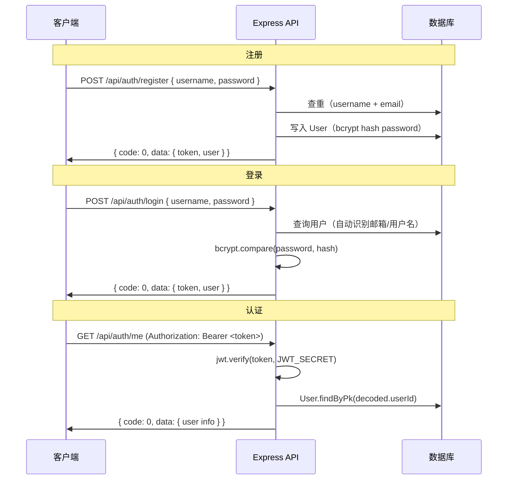

# 后端架构说明

> 美食食谱网站后端基于 **Express + Sequelize ORM + JWT** 构建，支持 SQLite/MySQL/PostgreSQL 多方言切换。

---

## 目录结构

```
backend/
├── app.js                  # Express 应用入口：中间件链 + 路由挂载
├── index.js                # 入口文件（加载 app 并监听端口）
├── server.js               # 生产运行脚本（含数据库同步 + 种子数据）
├── Dockerfile              # 多阶段构建：npm install → node server.js
├── package.json            # 依赖声明
│
├── config/
│   └── database.js         # Sequelize 实例配置（SQLite / MySQL / PG 切换）
│
├── middleware/
│   ├── auth.js             # JWT 认证中间件（Bearer Token 验证）
│   └── errorHandler.js     # 全局错误处理 + 未捕获异常捕获
│
├── models/
│   ├── index.js            # 模型自动加载器 + 关联注册
│   ├── user.js             # User 模型
│   ├── recipe.js           # Recipe 模型
│   └── favorite.js         # Favorite 模型（含软删除）
│
├── routes/
│   ├── index.js            # 路由总入口（统一挂载 /api 前缀）
│   ├── auth.js             # 认证路由：register / login / me
│   ├── recipes.js          # 食谱路由：CRUD + 搜索 + 推荐
│   ├── favorites.js        # 收藏路由（需认证）
│   └── users.js            # 用户信息路由
│
├── services/
│   └── favoriteService.js  # 收藏业务逻辑层（含缓存层）
│
├── seeds/
│   └── seed.js             # 种子数据（10 食谱 + 管理员用户）
│
├── scripts/
│   └── init.sql            # 生产库表初始化 SQL
│
└── .env                    # 环境变量
```

---

## 请求生命周期

```
  客户端                   Express Server
    │                          │
    │  ── HTTP Request ──────► │
    │                          │
    │                   ┌──────▼──────┐
    │                   │   Helmet    │  ← 安全头部
    │                   │   CORS      │  ← 跨域控制
    │                   │  RateLimit  │  ← 请求频率限制
    │                   │ JSON Parser │  ← 请求体解析
    │                   │  Logging    │  ← 请求耗时日志
    │                   └──────┬──────┘
    │                          │
    │                   ┌──────▼──────┐
    │                   │  /api 路由  │
    │                   │  ┌────────┐ │
    │                   │  │  auth  │ │  ← 无需认证
    │                   │  ├────────┤ │
    │                   │  │ recipes│ │  ← 混合（列表公开，写操作需认证）
    │                   │  ├────────┤ │
    │                   │  │  users │ │  ← 无需认证
    │                   │  ├────────┤ │
    │                   │  │  Auth  │ │  ← Bearer Token 验证
    │                   │  ├────────┤ │
    │                   │  │favorites││  ← 需认证
    │                   │  └────────┘ │
    │                   └──────┬──────┘
    │                          │
    │                   ┌──────▼──────┐
    │                   │  Controller │  ← 参数校验 + 业务逻辑
    │                   │  Service    │  ← 复杂业务（收藏缓存）
    │                   │  Model      │  ← ORM 查询
    │                   │  Database   │  ← SQLite / MySQL / PG
    │                   └──────┬──────┘
    │                          │
    │  ◄─── JSON Response ─────┤
```

---

## 认证流程

### JWT 令牌

- **算法**：HS256
- **Secret**：`process.env.JWT_SECRET`（开发环境有默认值）
- **有效期**：`process.env.JWT_EXPIRES_IN`，默认 `7d`
- **Payload 结构**：`{ userId, username, role, iat, exp }`

### 注册 → 登录 → 认证



### auth 中间件

```javascript
// middleware/auth.js — 核心逻辑
function auth(req, res, next) {
  const authHeader = req.headers.authorization
  if (!authHeader || !authHeader.startsWith('Bearer ')) {
    return res.status(401).json({ code: 401, message: '未授权，请先登录' })
  }
  const token = authHeader.slice(7)
  const decoded = jwt.verify(token, JWT_SECRET)
  req.userId = decoded.userId  // 注入请求上下文
  next()
}
```

---

## 中间件栈

| 顺序 | 中间件 | 功能 |
|------|--------|------|
| 1 | `helmet()` | 安全响应头 |
| 2 | `cors()` | 跨域设置，支持多域名（逗号分隔） |
| 3 | `rateLimit()` | 限流，默认 15 分钟 100 请求 |
| 4 | `express.json()` | JSON 请求体解析，上限 10MB |
| 5 | `express.urlencoded()` | URL-encoded 解析 |
| 6 | 日志中间件 | 记录每个请求方法/路径/状态码/耗时 |
| 7 | 路由 | `/api/*` 路由分发 |
| 8 | 404 处理 | 未匹配 API 返回 `{ code: 404 }` |
| 9 | 错误处理 | 四参数 errorHandler，生产环境不泄漏 stack |

---

## 环境变量

| 变量名 | 默认值 | 说明 |
|--------|--------|------|
| `NODE_ENV` | `development` | 运行环境 |
| `BACKEND_PORT` | `3001` | 后端监听端口 |
| `DB_DIALECT` | `sqlite` | 数据库方言：sqlite / mysql / postgres |
| `DB_HOST` | `127.0.0.1` | 数据库主机 |
| `DB_PORT` | `3306` | 数据库端口 |
| `DB_NAME` | `food_website` | 数据库名称 |
| `DB_USER` | `root` | 数据库用户 |
| `DB_PASS` | `''` | 数据库密码 |
| `DB_POOL_MAX` | `10` | 连接池最大连接数 |
| `DB_POOL_MIN` | `2` | 连接池最小连接数 |
| `JWT_SECRET` | `food-website-dev-secret` | JWT 签名密钥 |
| `JWT_EXPIRES_IN` | `7d` | JWT 有效期 |
| `CORS_ORIGIN` | `''` | 允许的跨域来源（逗号分隔） |
| `RATE_LIMIT_WINDOW_MS` | `900000` | 限流窗口（毫秒） |
| `RATE_LIMIT_MAX` | `100` | 窗口内最大请求数 |
| `AI_API_BASE_URL` | — | AI 推荐 API 地址 |
| `AI_API_KEY` | — | AI API 密钥 |
| `AI_MODEL` | `deepseek-v3.2` | AI 模型名称 |

---

## 响应格式

所有 API 返回统一 JSON：

```javascript
function resJSON(code, message, data) {
  return { code, message, data }
}
```

- `code === 0` 表示成功
- `code > 0` 表示业务错误
- 错误场景：参数校验错误（400）、认证失败（401）、权限不足（403）、资源冲突（409）

---

## 测试策略

- **测试框架**：Jest
- **测试位置**：`tests/` 目录（独立 package），通过 `npm run test` 执行
- **数据库**：使用独立 SQLite 内存数据库，每次测试自动创建/销毁
- **覆盖范围**：
  - 收藏服务层：添加/删除/列表/状态查询/计数（含幂等性测试）
  - API 路由：正确参数的 200 和错误参数的 400/401/404

```bash
# 运行测试
npm run test

# 当前覆盖率
#   后端 87% (854/982) ≥70% ✅
```

---

## Docker 部署

### Dockerfile

多阶段构建：

```dockerfile
# 构建阶段
FROM node:18-alpine AS builder
WORKDIR /app
COPY package*.json ./
RUN npm install
COPY . .

# 运行阶段
FROM node:18-alpine
WORKDIR /app
COPY --from=builder /app .
EXPOSE 3001
CMD ["node", "server.js"]
```

### 部署架构

```
Nginx (80) → Frontend Container (8081:80) → Backend Container (3000:3001) → MariaDB (宿主机)
```

- Nginx 反向代理前端静态资源
- 前端 Nginx 代理 `/api` 到后端容器
- Docker HEALTHCHECK 使用 `127.0.0.1`（避免 BusyBox wget IPv6 解析问题）
```
